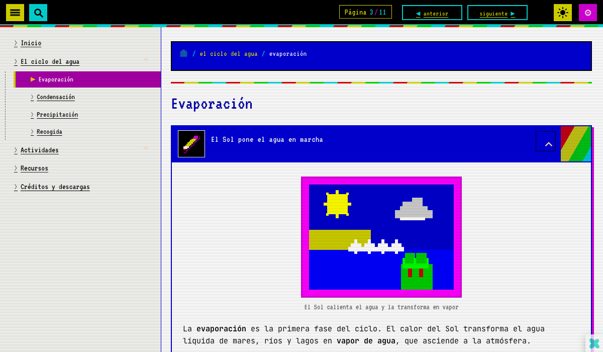

# eXeLearning Spectrum 128K

[![eXeLearning 3.0+](https://img.shields.io/badge/eXeLearning-3.0%2B-26ddc7?labelColor=1f2937&logo=data%3Aimage%2Fsvg%2Bxml%3Bbase64%2CPHN2ZyB4bWxucz0iaHR0cDovL3d3dy53My5vcmcvMjAwMC9zdmciIHZpZXdCb3g9IjAgLTAuNTE5IDYwLjE3MTUyIDYwLjE3MTUyIj4gPGcgdHJhbnNmb3JtPSJ0cmFuc2xhdGUoLTEwOS44MDIwOCwtMTIxLjE3OTE3KSI%2BIDxwYXRoIGQ9Im0gMTIwLjYzOTEyLDEyMS4xNzkxNiBjIDIuNTAyOTYsMCA1LjE3Njg0LDAuOTEwMiA4LjAyMTExLDIuNzMwNiAyLjc4NzY1LDEuNzYzNSA2LjYyNzU1LDQuODkyMzMgMTEuNTE5Nyw5LjM4NjQ0IDguNDE5MywtNy4wNTQwNiAxMi45MTAzNCwtOC42NDMwMSAxNy4yMzM2MywtOC42NDMwMSAyLjc4NzY1LDAgNS4xNzY4NCwwLjc2Nzk4IDcuMTY3ODMsMi4zMDM5NCAzLjY2NzkyLDIuODA0NzcgNC4yNzk2Myw5LjIxMDIyIDEuNzEsMTMuNDIxNTcgLTIuMDQ3ODcsMy4zNTYzNyAtNC43MjE3NSw2Ljk2ODczIC04LjAyMTExLDEwLjgzNzAxIDcuNTA5MTQsOC41MzMwOCAxMS43MDMzMiwxNC42NzMgMTEuNzAzMzIsMTguODgyNzkgMCwzLjAxNDkyIC0wLjkzODc0LDUuMzE4OTIgLTIuODE1OTYsNi45MTE3MSAtMS45MzQxMSwxLjU5Mjc5IC00LjM1MTg3LDIuMzg5MTkgLTcuMjUzMDMsMi4zODkxOSAtNC4zODA0NCwwIC0xMS4yNDg0OSwtMy4zMjM3IC0xOS43MjQ2OCwtMTAuNDM0NjQgLTQuODM1MjYsNC4yNjY0IC04LjY0Njg1LDcuMjI0NzEgLTExLjQzNDI0LDguODc0MzkgLTIuODQ0NTMsMS42NDk2NyAtNS41NDY3MiwyLjQ3NDY1IC04LjEwNjU3LDIuNDc0NjUgLTMuNDEzMjMsMCAtNi4wNTg1LC0xLjEwOTQgLTcuOTM1NzgsLTMuMzI3OTMgLTEuOTM0MTgsLTIuMjc1NjggLTIuOTAxMjYsLTQuOTQ5MyAtMi45MDEyNiwtOC4wMjExMSAwLC0xLjk5MTI2IDAuMjg0NDMsLTMuNzI2MTMgMC44NTMzMSwtNS4yMDU0MSAwLjU2ODg4LC0xLjQ3OTAzIDEuNjIxMjksLTMuMTI4NyAzLjE1NzI1LC00Ljk0OTA0IDEuNTM1OTYsLTEuODc3NDggMy45ODIxMywtNC40NjU2MyA3LjMzODQ1LC03Ljc2NTI1IC0zLjI0MjU0LC0zLjI5OTM2IC01LjYzMTgxLC01Ljk0NDcxIC03LjE2NzgsLTcuOTM1NzYgLTEuNTkyODQsLTIuMDQ3OTUgLTIuNjczNjksLTMuODM5OTIgLTMuMjQyNTcsLTUuMzc1ODggLTAuNjI1NzcsLTEuNTM1OTYgLTAuOTM4NjQsLTMuMjQyNTcgLTAuOTM4NjQsLTUuMTE5ODcgMCwtMS45OTEwNyAwLjQyNjY0LC0zLjgzOTkgMS4yNzk5NSwtNS41NDY1MSAwLjg1MzM0LC0xLjc2MzUzIDIuMTA0ODQsLTMuMTg1NzIgMy43NTQ2LC00LjI2NjU4IDEuNjQ5NzMsLTEuMDgwODcgMy41ODM5MSwtMS42MjEzIDUuODAyNDksLTEuNjIxMyB6IiBmaWxsPSIjMjZkZGM3Ii8%2BIDwvZz4gPC9zdmc%2B)](https://exelearning.net)

[![Edit in eXeLearning](https://img.shields.io/badge/Edit%20in-eXeLearning-26ddc7?labelColor=1f2937&logo=data%3Aimage%2Fsvg%2Bxml%3Bbase64%2CPHN2ZyB4bWxucz0iaHR0cDovL3d3dy53My5vcmcvMjAwMC9zdmciIHZpZXdCb3g9IjAgLTAuNTE5IDYwLjE3MTUyIDYwLjE3MTUyIj4gPGcgdHJhbnNmb3JtPSJ0cmFuc2xhdGUoLTEwOS44MDIwOCwtMTIxLjE3OTE3KSI%2BIDxwYXRoIGQ9Im0gMTIwLjYzOTEyLDEyMS4xNzkxNiBjIDIuNTAyOTYsMCA1LjE3Njg0LDAuOTEwMiA4LjAyMTExLDIuNzMwNiAyLjc4NzY1LDEuNzYzNSA2LjYyNzU1LDQuODkyMzMgMTEuNTE5Nyw5LjM4NjQ0IDguNDE5MywtNy4wNTQwNiAxMi45MTAzNCwtOC42NDMwMSAxNy4yMzM2MywtOC42NDMwMSAyLjc4NzY1LDAgNS4xNzY4NCwwLjc2Nzk4IDcuMTY3ODMsMi4zMDM5NCAzLjY2NzkyLDIuODA0NzcgNC4yNzk2Myw5LjIxMDIyIDEuNzEsMTMuNDIxNTcgLTIuMDQ3ODcsMy4zNTYzNyAtNC43MjE3NSw2Ljk2ODczIC04LjAyMTExLDEwLjgzNzAxIDcuNTA5MTQsOC41MzMwOCAxMS43MDMzMiwxNC42NzMgMTEuNzAzMzIsMTguODgyNzkgMCwzLjAxNDkyIC0wLjkzODc0LDUuMzE4OTIgLTIuODE1OTYsNi45MTE3MSAtMS45MzQxMSwxLjU5Mjc5IC00LjM1MTg3LDIuMzg5MTkgLTcuMjUzMDMsMi4zODkxOSAtNC4zODA0NCwwIC0xMS4yNDg0OSwtMy4zMjM3IC0xOS43MjQ2OCwtMTAuNDM0NjQgLTQuODM1MjYsNC4yNjY0IC04LjY0Njg1LDcuMjI0NzEgLTExLjQzNDI0LDguODc0MzkgLTIuODQ0NTMsMS42NDk2NyAtNS41NDY3MiwyLjQ3NDY1IC04LjEwNjU3LDIuNDc0NjUgLTMuNDEzMjMsMCAtNi4wNTg1LC0xLjEwOTQgLTcuOTM1NzgsLTMuMzI3OTMgLTEuOTM0MTgsLTIuMjc1NjggLTIuOTAxMjYsLTQuOTQ5MyAtMi45MDEyNiwtOC4wMjExMSAwLC0xLjk5MTI2IDAuMjg0NDMsLTMuNzI2MTMgMC44NTMzMSwtNS4yMDU0MSAwLjU2ODg4LC0xLjQ3OTAzIDEuNjIxMjksLTMuMTI4NyAzLjE1NzI1LC00Ljk0OTA0IDEuNTM1OTYsLTEuODc3NDggMy45ODIxMywtNC40NjU2MyA3LjMzODQ1LC03Ljc2NTI1IC0zLjI0MjU0LC0zLjI5OTM2IC01LjYzMTgxLC01Ljk0NDcxIC03LjE2NzgsLTcuOTM1NzYgLTEuNTkyODQsLTIuMDQ3OTUgLTIuNjczNjksLTMuODM5OTIgLTMuMjQyNTcsLTUuMzc1ODggLTAuNjI1NzcsLTEuNTM1OTYgLTAuOTM4NjQsLTMuMjQyNTcgLTAuOTM4NjQsLTUuMTE5ODcgMCwtMS45OTEwNyAwLjQyNjY0LC0zLjgzOTkgMS4yNzk5NSwtNS41NDY1MSAwLjg1MzM0LC0xLjc2MzUzIDIuMTA0ODQsLTMuMTg1NzIgMy43NTQ2LC00LjI2NjU4IDEuNjQ5NzMsLTEuMDgwODcgMy41ODM5MSwtMS42MjEzIDUuODAyNDksLTEuNjIxMyB6IiBmaWxsPSIjMjZkZGM3Ii8%2BIDwvZz4gPC9zdmc%2B)](https://static.exelearning.dev/?url=https://github-proxy.exelearning.dev/?repo=ateeducacion/exelearning-style-spectrum128k&branch=main)

Estilo retro para eXeLearning inspirado en el Sinclair ZX Spectrum 128K: franjas multicolor, paleta BRIGHT, tipografía pixel y efecto CRT opcional.

<a href="https://static.exelearning.dev/?url=https://github-proxy.exelearning.dev/?repo=ateeducacion/exelearning-style-spectrum128k&amp;branch=main" target="_blank" rel="noopener">▶ Abrir el ejemplo en eXeLearning</a> · <a href="https://github.com/ateeducacion/exelearning-style-spectrum128k/releases/latest/download/spectrum128k.zip" target="_blank" rel="noopener">↓ Descargar estilo (última release)</a>

Creado por el **Área de Tecnología Educativa** de la Consejería de Educación, Formación Profesional, Actividad Física y Deportes del Gobierno de Canarias.

Licencia del contenido propio del repositorio: [Creative Commons CC0 1.0 Universal](https://creativecommons.org/publicdomain/zero/1.0/). Esto incluye el estilo Spectrum 128K, el ejemplo didáctico y las ilustraciones generadas. Los componentes de terceros mantienen sus licencias propias.

## Estructura

- **`theme/`** — el estilo Spectrum 128K (lo que se empaqueta como `spectrum128k.zip` en cada release).
- **Raíz** — ELPX descomprimido con el ejemplo *el ciclo del agua*, previsualizable con cualquier servidor estático (`python3 -m http.server`) y servido en directo por `github-proxy.exelearning.dev` al abrir el enlace de arriba.

## Panel de tweaks

El estilo expone un panel (botón de engranaje de la barra superior) con tres ajustes persistentes en `localStorage`:

- **franjas** — `128k` (diagonal, por defecto) · `48k` (vertical) · `mono`.
- **fuente pixel** — VT323 solo en titulares o en todo el texto.
- **scanlines CRT** — on/off.

## Colección de estilos

Estilos de eXeLearning del Área de Tecnología Educativa. Cada repositorio incluye el estilo y un recurso de ejemplo que se puede abrir directamente en eXeLearning.

<table>
  <tr>
    <td align="center" width="20%"><a href="https://github.com/ateeducacion/exelearning-style-book"> <b>Libro</b></a> Libro abierto con paso de página</td>
    <td align="center" width="20%"><a href="https://github.com/ateeducacion/exelearning-style-pocket"> <b>Pocket</b></a> Consola portátil de pantalla verde</td>
    <td align="center" width="20%"><a href="https://github.com/ateeducacion/exelearning-style-hacker"> <b>Hacker</b></a> Terminal con Matrix, Tron y PipBoy</td>
    <td align="center" width="20%"><a href="https://github.com/ateeducacion/exelearning-style-spectrum128k"> <b>Spectrum 128K</b></a> ZX Spectrum con franjas y CRT</td>
    <td align="center" width="20%"><a href="https://github.com/ateeducacion/exelearning-style-scumm"> <b>SCUMM Adventure</b></a> Aventura gráfica con verbos e inventario</td>
  </tr>
</table>

Los estilos oficiales para los centros educativos de Canarias (Flux, Nova y REF) están en [exelearning-styles-canarias](https://github.com/ateeducacion/exelearning-styles-canarias).

## Créditos

Tipografías [VT323](https://fonts.google.com/specimen/VT323) y [JetBrains Mono](https://www.jetbrains.com/lp/mono/), ambas bajo SIL Open Font License 1.1. Comunidad de [eXeLearning](https://exelearning.net/), mantenida por el [CEDEC](https://cedec.intef.es/) y las distintas administraciones educativas del Estado.
